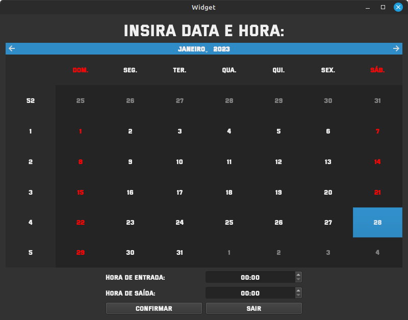

# Sistema de Controle e Gestão de Salas

## Próposito
O projeto é um sistema para a gestão de salas, relacionando pessoas, datas e horários a uma sala para reserva. O projeto foi desenvolvido em python utilizando da biblioteca PySide6 para desenvolvimento de interfaces Qt.

## Telas

### Tela login

### Tela calendário
Tela onde o funcionário deverá escolher data e hora para reserva.

### Tela ambiente

### Menu

### Cadastro de clientes

### Cadastro e edição de salas

Fonte utilizada no projeto <a href="https://www.dafont.com/pt/versa-versa.font" target="_blank">www.dafont.com/pt/versa-versa.font</a>
