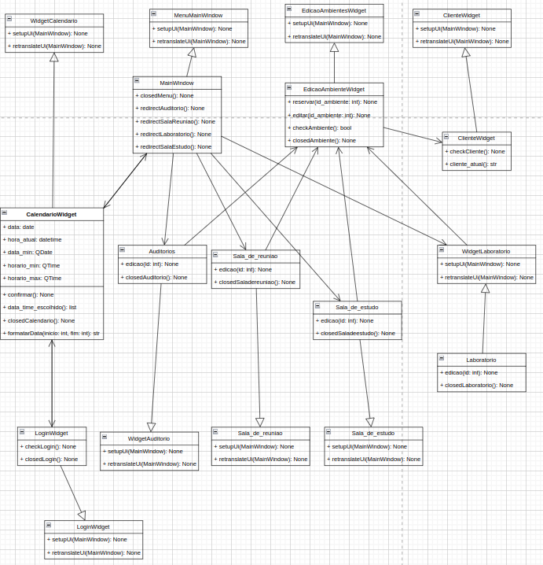
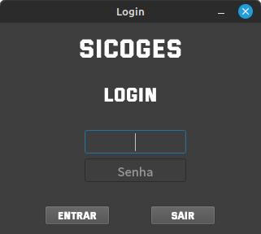
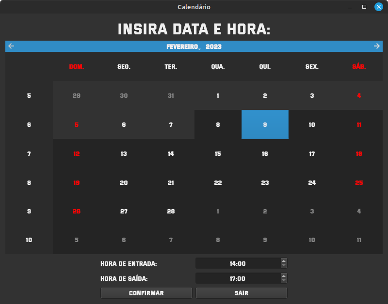
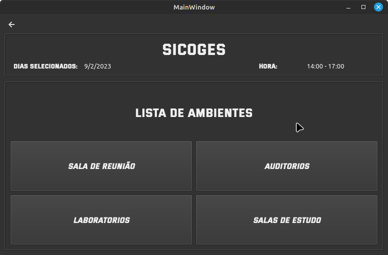
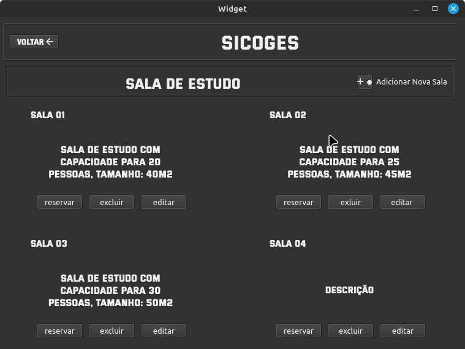
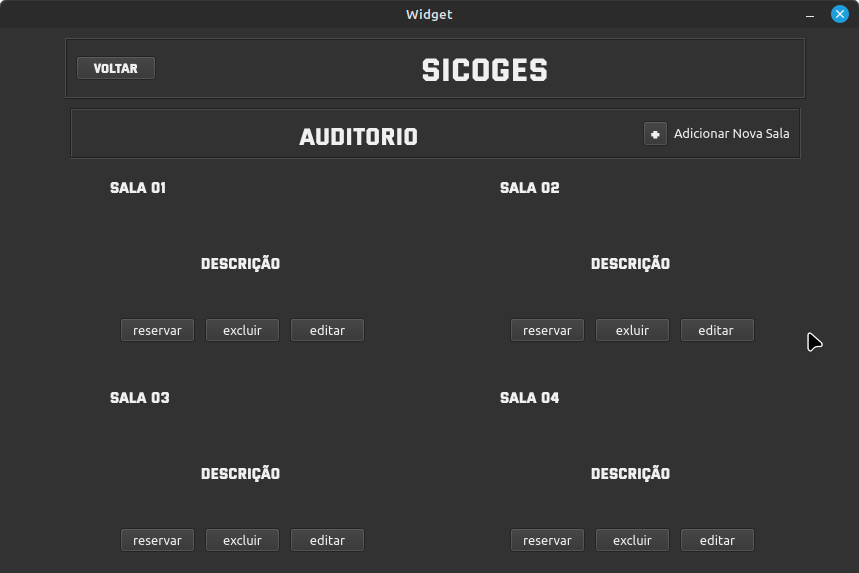
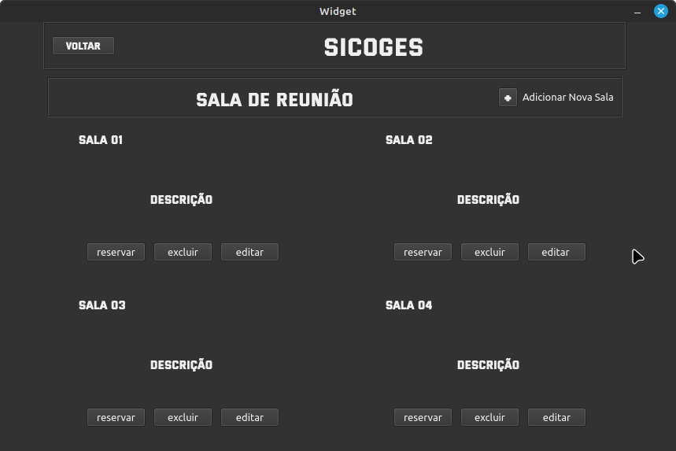
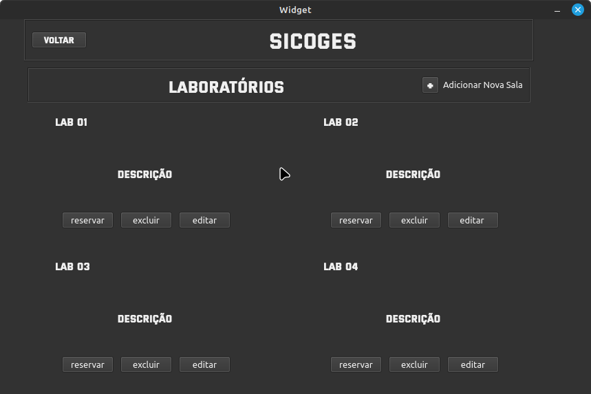
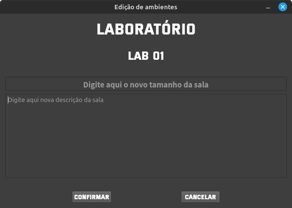

# SICOGES - Sistema de Controle e Gestão de Salas

*******
**Sumário**

1. [Integrantes](#integrantes)

2. [Propósito](#proposito)

3. [Ferramentas usadas no projeto](#ferramentas)

4. [Diagramas UML](#diagramas)
    - [Diagrama de caso de uso](#casouso)
    - [Diagrama de classe](#diagclasse)
    
5. [Telas](#telas)
    - [Tela de login](#telalogin)
    - [Tela do calendário](#telacalen)
    - [Tela menu](#telamenu)
    - [Telas de ambientes](#telaambiente)
    - [Tela de cadastro de clientes](#telacliente)
    - [Tela de edição de salas](#telaedicao)
    - [Tela de relatório de salas reservadas](#telarelatorio)    
    
6. [Referências](#ref)

*******

## Integrantes

* [Alycson Denis Pereira Moreira](https://github.com/Alycson-Moreira)
* [Layza Cecato Gomes Amaro](https://github.com/layzacecato-dev)
* [Alessandro Nunes Silva Cruz Filho](https://github.com/AlessandroNunes10)
* [Guilherme Cadete Matias](https://github.com/kadetete)
* [Rafael Augusto Soares da Silva](https://github.com/Rafael)

## Propósito

Este projeto foi proposto como trabalho de conclusão da disciplina de POO (Programação Orientada a objetos), foi sugerido um sistema para a gestão de salas, relacionando pessoas, datas e horários a uma sala para reserva. O projeto foi desenvolvido em python utilizando da biblioteca PySide6 para desenvolvimento de interfaces Qt integrado com o MySQL para o banco de dados.

## Ferramentas usadas no projeto
Reunimos a equipe para decidir qual aplicativo seria usado para auxiliar no gerenciamento do projeto, indicada pelos integrantes da equipe, 

* [Layza Cecato](https://github.com/layzacecato-dev), adotamos o aplicativo [**TRELLO**](https://trello.com/home) para esta função como sugestão.

* Diagrama UML de caso de uso foi feito na plataforma [**CREATELY**](https://creately.com/) como sugestão de [Alycson Moreira](https://github.com/Alycson-Moreira).

* O Qt Designer foi ultilizado com ferramenta para criação das interfaces.

* O WhatsApp foi utilizado como ferramenta de comunicação rápida entre os integrantes.

* Para a implementação do banco de dados foi ultilizado o Sistema Gerenciador de Banco de Dados (SGBD) MySQL Workbench.

## Diagramas UML

### Diagrama de caso de uso
Baseado no prototipo de telas foi feito o diagrama UML de caso de uso onde nele apresentamos o fluxo e funcionalidades das telas. 

### Diagrama de classe
O diagrama de classe feito analisa as classes do código e desenha suas relações de herança e associação.

## Telas

### Tela 01 - Login
Nessa tela o usuário do sistema, projetado para ser um funcionário de uma empresa, irá entrar com usuário e senha para acessar a área de agendamento de salas. O programa compara as informações digitadas com as presentes no banco e valida os dados para que o software possa ser utilizado.

### Tela 02 - Calendário
Após o login o funcionário é redirecionado para a tela de calendário(que segue abaixo), onde é selecionado a data e horário para reserva da sala. O usuário só pode fazer reservas a partir do dia atual.

### Tela 03 - Menu
Nesta tela principal o funcionário/usuário do sistema terá a opção de escolher o ambiente que será reservado.

### Tela 04 - Ambientes
A tela apresenta a interface dos ambientes e dispões de funcionalidade de: reserva, edição e exclusão das salas, além de um botão para adicionar uma nova.

### Tela 05 - Cadastro de clientes
Aqui fazemos o cadastro do cliente que deseja reservar alguma das salas da empresa.

### Tela 06 - Edição de salas
Tela que aparece após clicar na opção 'editar' de uma das telas de ambiente. Aqui, aparecerá no topo o tipo de ambiente que você está editando, e o logo abaixo a sala específica. Nos campos são inseridos o tamanho e a descrição para serem modificadas.

### Tela 07 - Relatorio de Salas Reservadas
Na última tela desenvolvida, é mostrada a relação das reservas realizadas no sistema e armazenadas no banco de dados.

## Referências
* Fonte utilizada no projeto: [Versa Versa](www.dafont.com/pt/versa-versa.font)
* Ferramenta utilizada para organização: [Trello](https://trello.com/home)
* Ferramenta utilizada para criação das interfaces gráficas: [Qt Creator](https://www.qt.io/product/development-tools)
* A linguagem utilizada para desenvolvimento foi Python com integração ao Qt

###### OBS: Todos os integrantes participaram ativamente de todos os processos de desenvolvimento.
